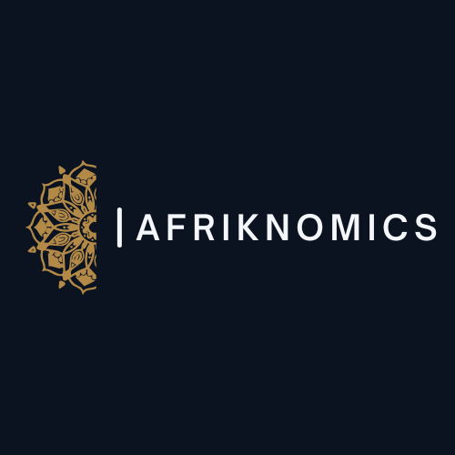

# Bienvenue

## Étudiant · Chercheur · Analyste

Je travaille principalement sur :

- l'économie du développement ;
- la fiscalité ;
- l'agriculture ;
- l'économétrie ;
- l'Afrique ;
- l'économie islamique.

---

## Statistiques du site

--8<-- "includes/stats.md"

---

## Derniers articles

--8<-- "includes/latest_articles.md"

---

## Dernières lectures

--8<-- "includes/latest_books.md"

---

## Derniers podcasts

- Podcast 001
- Podcast 002
- Podcast 003

---

## Domaines d'expertise

🌍 Afrique

🌾 Agriculture

☪️ Économie islamique

📊 Économétrie

🏛 Fiscalité

📚 Recherche académique